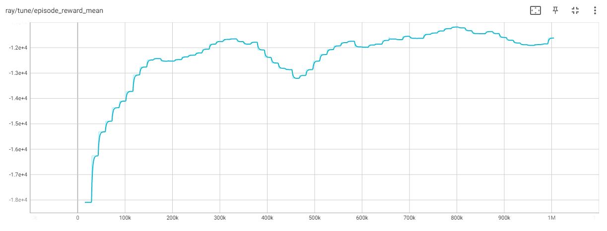

# Mixed Traffic Control at Complex Intersections via Multi-agent Reinforcement Learning
Official code for the paper:

> **Learning to Control and Coordinate Mixed Traffic Through Robot Vehicles at Complex and Unsignalized Intersections**
>
> Dawei Wang, Weizi Li, Lei Zhu, Jia Pan
>
> <a href='https://arxiv.org/abs/2301.05294'></a> <a href='https://sites.google.com/view/mixedtrafficcontrol/'></a>


## Setup with Docker 
### Requirements
    docker
    nvidia-docker
    Ubuntu

We highly recommend installing on Ubuntu 22.04 as this version of Ubuntu has been tested. If you have a Windows machine, we recommend using WSL to create an Ubuntu 22.04 virtual machine for setting up the repo.

Install docker on your version of Ubuntu by following the instructions provided [here](https://docs.docker.com/engine/install/ubuntu/).
Follow the steps under the heading "Install using the Apt repository."

Install nvidia-docker on your version of Ubuntu by following the instructions provided [here](https://docs.nvidia.com/datacenter/cloud-native/container-toolkit/latest/install-guide.html).
Follow the steps under the headings "Installing with Apt" and "Configuring Docker."

### Download Docker image
    docker pull wangdawei1996/ray_sumo:beta5

### Run docker container
    docker run -it \
        -p 0.0.0.0:6006:6006 \
        --gpus all \
        --shm-size=10.01gb \
        wangdawei1996/ray_sumo:beta5 bash

## Setup with Anaconda (recommended)
### Requirements
    Ubuntu

We highly recommend installing on Ubuntu 22.04 as this version of Ubuntu has been tested. If you have a Windows machine, we recommend using WSL to create an Ubuntu 22.04 virtual machine for setting up the repo.

### Install SUMO
Please follow the official instructions provided [here](https://sumo.dlr.de/docs/Installing/index.html).
It should involve just running the following command:
```
sudo apt-get install sumo sumo-tools sumo-doc
```
We recommend SUMO v1.12.0. If you use a later version of SUMO, be aware that the units for fuel consumption are different on later versions. The resulting number is the same as older versions, only the units are different.

### Setup Conda environment
    conda create --name MixedTrafficControl python=3.7
    conda activate MixedTrafficControl
    pip install -r requirements.txt

## Training
    
To train a model, an example command is the following:
```
python DQN_run.py --rv-rate 1.0 --stop-iters 1000 --framework torch --num-cpu 16
```       

Depending on your CPU, you may need to lower num-cpu to a smaller value. The rv-rate value can be anything between 0 to 1.0. Tensorflow 1 and Tensorflow 2 can be selected as the framework by providing "tf" or "tf2", respectively, as the framework; however, we recommend using torch (PyTorch) as the framework.

During training, you should expect to see "nan" as the reward values for the first 15 iterations of training. After those iterations, the values will update in those fields. Additionally, warnings will be given during training. These warnings are okay and do not affect training.

For reference, an example reward curve after training using the above command should look like:


## Evaluation
To evaluate a trained model, an example command is the following:
```
python DQN_eval.py --rv-rate 1.0 --model-dir /path/to/model --save-dir /path/to/save/folder --stop-timesteps 1000
```

The rv-rate should match the rv-rate provided in the training command. The model-dir value should direct to the specific checkpoint number that you want to evaluate. The save-dir should direct to the folder/directory where you want to save the evaluation results.

A more filled-out example command is the following:
```
python DQN_eval.py --rv-rate 1.0 --model-dir /home/*username*/ray_results/DQN_RV*rv-rate*/*trial-name*/*checkpoint_number* --save-dir /home/*username*/*evaluation-dir* --stop-timesteps 1000
```

Both paths provided are absolute paths, but they could also be relative paths. Absolute paths are provided to avoid any assumptions on the current working directory. Any value between *'s needs to provided. Note: *trial-name* is typically a long string, so we recommend renaming it to something more meaningful. The format of *checkpoint_number* is something like "checkpoint_00770" or "checkpoint_001000"; however, we also recommend saving the checkpoint name as something more meaningful depending on what metric you're observing.


## Tensorboard
You can track training or view the results of training by using tensorboard.
```
tensorboard --logdir /path/to/ray_results/folder
```

There are numerous metrics that are saved during training so you may have to click through the "Previous" and "Next" buttons to find a metric of interest.

Most likely, the command for starting Tensorboard will look like (assuming you've opened a fresh terminal interface in Ubuntu):
```
tensorboard --logdir ray_results/DQN_RV*rv-rate*/
```

The "rv_rate" portion of the above command should be replaced with whatever RV penetration rate you want to observe.


## **Citation**

If you find the code useful for your work, please star this repo and consider citing:

```
@article{wang2023intersection,
  title={Learning to Control and Coordinate Mixed Traffic Through Robot Vehicles at Complex and Unsignalized Intersections},
  author={Wang, Dawei and Li, Weizi and Zhu, Lei and Pan, Jia},
  journal={arXiv preprint arXiv:2301.05294},
  year={2023}
}
```
